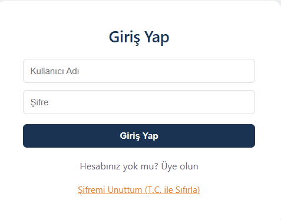
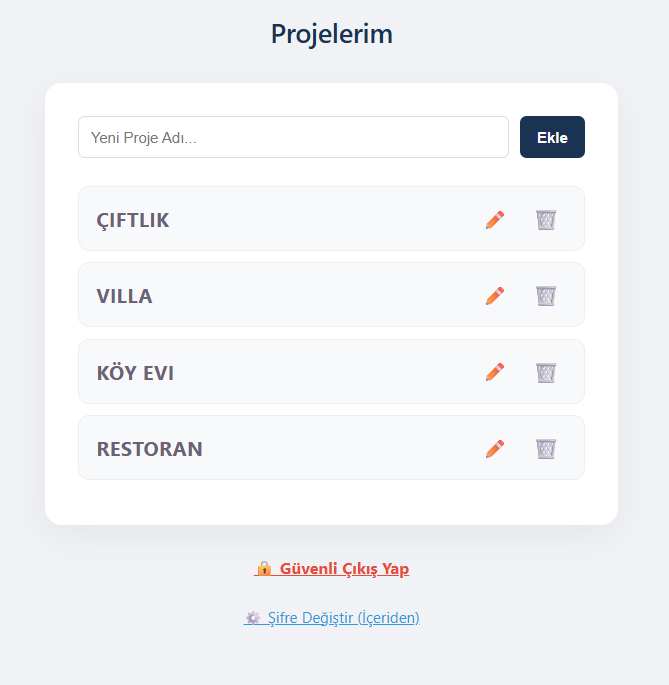
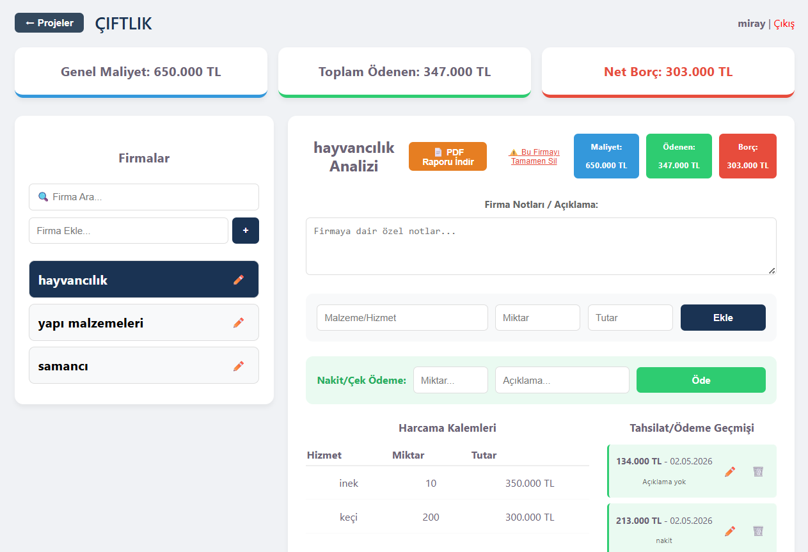

# NOA Yazılım - Proje Takip Sistemi

Baban için özel olarak geliştirilmiş, projelerin ve firma ödemelerinin takip edildiği yönetim paneli.

## 📸 Uygulama Ekran Görüntüleri

### 1. Giriş Ekranı ve Güvenlik
Sisteme güvenli erişim sağlayan giriş paneli.

### 2. T.C. ile Şifre Sıfırlama
E-posta karmaşası olmadan, T.C. kimlik numarasının ilk 4 hanesiyle hızlı ve güvenli şifre yenileme.

### 3. Proje Yönetimi
Tüm aktif projelerin listelendiği ve yeni projelerin oluşturulduğu ana merkez.

### 4. Firma Analizi ve Ödeme Takibi
Firmaların borç/alacak durumu, harcama kalemleri ve detaylı ödeme geçmişi.

## 🛠️ Kullanılan Teknolojiler
* **Frontend:** React, Vite, Axios
* **Backend:** Node.js, Express
* **Veritabanı:** MongoDB Atlas
* **Raporlama:** jsPDF (PDF çıktı desteği)